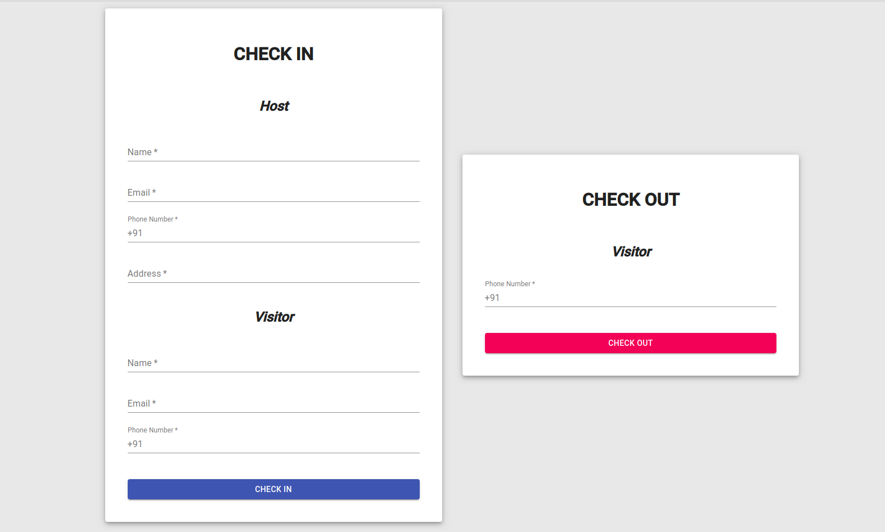
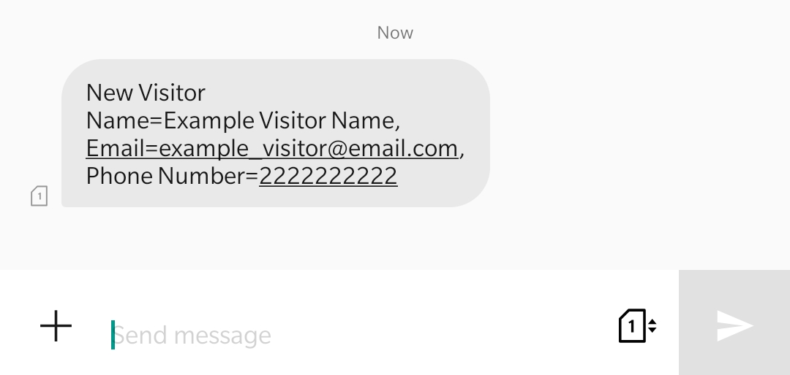

# summergeeks-2020
Assignment project for the role of SDE Intern 2020 at Innovaccer.

<br>

## About the Product
It is a responsive webapp for tracking visitors in a residence society or an office. Visitors are registered at the time of their entrance, and their hosts are immediately notified via email as well as SMS. As soon as the visitor checks out, he/she receives an email containing a brief summary about their visit.

<br>

#### You can checkout the live product [here](http://summergeeks-2020.innovaccer.s3-website.ap-south-1.amazonaws.com/).

<br>

### Underlying REST API
You can find GitHub repository of the underlying REST API [here](https://www.github.com/saran-shabd/innovaccer-summergeeks-2020). It contains it's own documentation and steps for local environment deployment.

<br>

## Tech Stack
- React.js
- Axios
- Material UI

<br>

## Steps for Local Development
- Install `node` on your local machine, with it you'll also get `npm` (Node Package Manager).
- Clone the repository by running `git clone https://github.com/saran-shabd/summergeeks-2020.git`
- Deploy the underlying REST API, you can find instructions for local deployment of the REST API [here](https://www.github.com/saran-shabd/innovaccer-summergeeks-2020).
- Create a new file in project's root directory named `.env.development`, copy-paste the following content in the file:
  ```
  REACT_APP_API_URL=http://localhost:8000
  ```
- Start the REST API server, instructions [here](https://www.github.com/saran-shabd/innovaccer-summergeeks-2020).
- Now run `npm start` to deploy the website on your local environment. By default, it will be hosted on post 3000.

<br>

## Screenshots

#### 1. Homepage


#### 2. Checkin Visitor


#### 3. SMS sent to the Host


#### 4. Email sent to the Host


#### 5. Checkout Visitor


#### 6. Email sent to the Visitor

